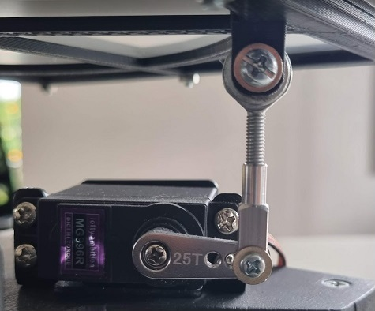
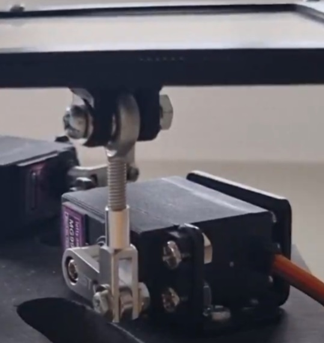

Servo Arms and Plate Assembly
=============================

Servo Brackets
------------

1. Attach the servo brackets to the base using the M4 screws, washers and nuts.
2. Attach the servos to the brackets using the M4 screws and nuts supplied with the brackets.
3. Using a servo tester, set the servo position to the center of its range of motion (1500us pulse).

**Note:** If you don't have a servo tester, you can use the [LevelBoard.ino](../LevelBoard/LevelBoard.ino) Aruino sketch to set the position.

Servo Arms
----------

1. Attach the Servo Arm to the servo in a horizontal alignment. Use the screw provided with the servo to secure it.
2. Attach the Clevis to the end of the servo arm using the 10mm M3 screws, nuts and 3 washers. The servo arm is 2.5mm thick, but the clevis gap is 3mm, so you will need to use a washer to fill the gap.
3. Screw the Fisheye Rod into the end of the clevis.

Plate Assembly
--------------

1. Put the 3D printed Panel Top piece on a flat surface.
2. Lay the touch panel on top of it.
3. Put the Panel Border piece around the touch panel.
4. Put the Underside piece on top.
5. Join them together using 10mm M3 screws and nuts.
6. Attach the underside to the Fisheye Rods using M4 screws, washers and nuts.

Electrical Connections
----------------------

1. Plug the 3 servo connectors into the PCB. Looking down on the base, M1 is at the 9 o'clock position, M2 at 1 o'clock and M3 at 5 o-clock.
2. Plug the touch panel into J1. You may need some extension wires if the panel's cable is not long enough. You will check the orientation of the plug later in the software setup.
