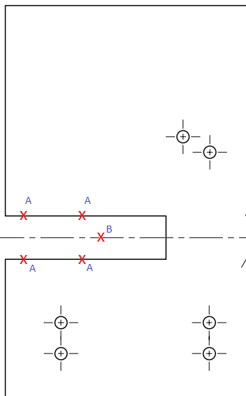

Assemble the Wooden Base
==========================

Drill and Cut the Base Plate
----------------------------

1. Use a saw to trim the 18mm pine panel to approximately 170mm x 150mm. If you're buying the panel from Bunnings, you can get them to cut it for you.
2. Cut out the printed [base template](../CADv2/BasePlate.pdf) and stick it to the pine panel.
3. Use a centre punch to mark the holes to drill for the servo mounts.
4. Use the centre punch to mark some points along the solid lines of the cut-out channel A. Also, mark a point B at the centre of the end of the channel. (See diagram below).
5. Remove the paper base template from the wood before drilling. Mark this side as the top.
6. Use a 4mm drill bit to drill the holes for the servo mounts.
7. Use a 16mm wood spade bit to drill the point B.
8. Use a jigsaw to cut along the lines formed by points A to the hole at point B.

PCB Mounting Holes
------------------

1. Using the blank PCB (with no components soldered) as a template, mark the 4 mounting holes on the bottom of the base plate.
2. Use a 2mm drill bit to drill the mounting holes.
3. Screw the 1/4" Length, 2-56 Thread Standoffs into the mounting holes.

Cut and Attach the Legs
-----------------------

1. Cut 4 legs from the 42mm x 19mm pine DAR. Each leg should be 25mm x 42mm x 19mm.
2. Use wood glue to stick the legs to the underside of the base plate.
3. Wait for the glue to dry.
4. Drill a 3mm hole in each corner from the top of the base plate down into the leg. Screw in a 35mm 8G self-tapping screw for extra stability.
5. Paint the base the desired colour. I used matte black to match the servos and 3D printed frame.
